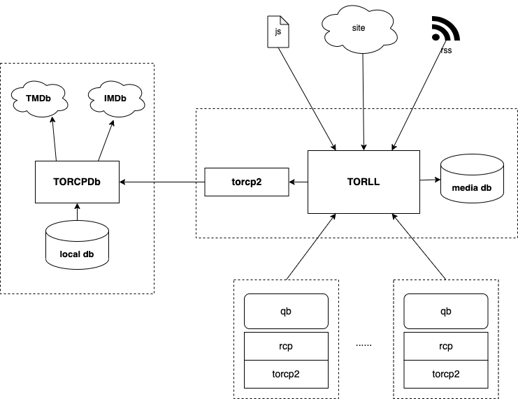

# TORCP2DB

* 以 api 接口形式，提供对 TMDb/IMDb 的查询
* 本地缓存查询结果
* 以 web ui 形式提供本地缓存数据库的查询、修改
* 与 torcp2 对应，这是 server 端
* 支持自定义条目和修改现有条目，以应对 TMDb 乱来的情况


## 框图


> 现在 torll 支持多个远程的 qbit，在他们下载完成时，远程入库
> 图中每个 qbit 节点，需包含一个 rcp 和一个 torcp2


## 安装
```sh
git clone https://github.com/ccf-2012/torcpdb.git
cd torcpdb
pip install -r requirements.txt
```

## 配置 config.ini
* 手工编辑 `config.ini`, 内容形如：
```ini
[TMDB]
tmdb_api_key = your_tmdb_api
tmdb_lang = zh-CN


[AUTH]
user = ccf
pass = something
client_api_key = something
```


